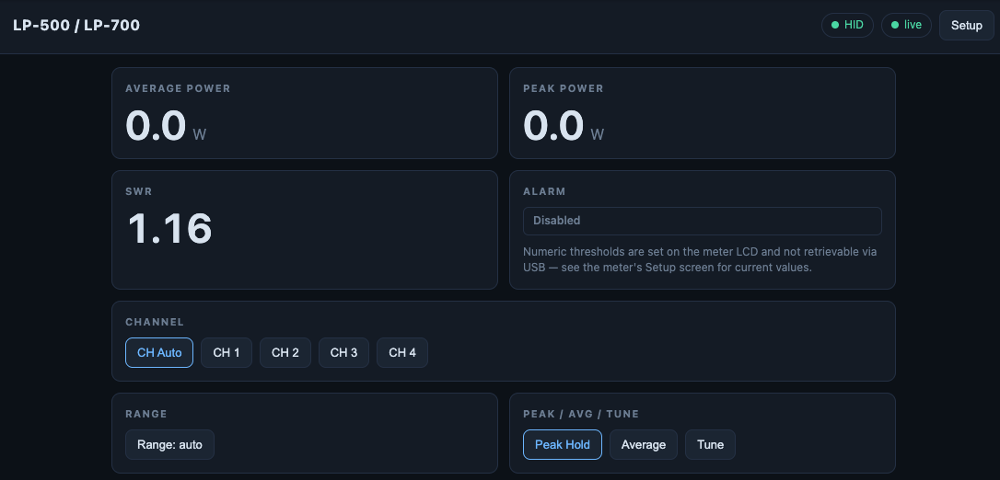

# LP-700 Server — User Manual

A short guide for operators of the **LP-700 Server** web client. If you
are setting the server up for the first time, read [README.md](README.md)
for build / install / deploy steps; this manual picks up once the
service is running and you can browse to it from your LAN.

---

## 1. First launch

After [installation](README.md#deploying-on-the-raspberry-pi) the
service listens on port **8089** of the Pi by default. From any device
on the same network, open:

```
http://<pi-host>:8089/
```

(`<pi-host>` is whatever name or IP you used in `redeploy.sh`, e.g.
`raspberrypi.local` or `192.168.86.43`.)

If the page loads but no values appear, see
[§5 Troubleshooting](#5-troubleshooting).

---

## 2. The screen at a glance



The reference client mirrors the meter's **Power/SWR** screen — the
values you see in the browser are exactly what the meter LCD is
showing, updated several times a second.

| Region                 | What it shows                                                                                                |
|------------------------|--------------------------------------------------------------------------------------------------------------|
| Title (top-left)       | Server `title` from `config.toml` (defaults to *LP-500 / LP-700*)                                            |
| **HID** / SIMULATOR    | Backend pill. Green **HID** = real meter on USB. Yellow **SIMULATOR** = synthesised data; the server didn't find a meter on USB. |
| **live** / disconnected | Connection state to the WebSocket. Green = receiving frames; yellow = reconnecting; red = error.            |
| Setup (top-right)      | Opens the runtime settings overlay (see [§4](#4-runtime-settings-setup-overlay)).                            |
| Average power          | Average forward power in watts (the meter's `AV` reading).                                                   |
| Peak power             | Live peak-envelope power in watts (the meter's `PK` reading).                                                |
| SWR                    | Standing-wave ratio, floor 1.00.                                                                             |
| Alarm                  | Disabled / Armed / **TRIPPED**. Click to toggle enable/disable.                                              |
| Channel                | `CH Auto` (meter picks 1..4) or one of `CH 1`–`CH 4`. The active option is highlighted.                      |
| Range                  | Cycles through `5W`, `10W`, `25W`, `50W`, `100W`, `250W`, `500W`, `1K`, `2.5K`, `5K`, `10K`, `auto`.         |
| Peak / Avg / Tune      | Display mode for the meter's large numeric area; the active option is highlighted.                           |

Both **Average** and **Peak** are always live regardless of which
display mode the meter's big numeric area is showing — they mirror the
small `57 AV / 94 PK` indicators that are always visible on the LCD.

---

## 3. Controls

Every button issues a single-step verb to the meter; the meter applies
it and the new state echoes back to all connected clients within one
poll cycle (~40 ms). If you and someone else click the same button at
nearly the same time, both presses are honoured in order — the meter
ends up at the second step.

| Button             | Effect on the meter                                                |
|--------------------|--------------------------------------------------------------------|
| **CH Auto / CH 1..4** | Sets the active channel (Auto, or one of the four couplers).    |
| **Range: …**       | Single press advances one notch through the range table.           |
| **Peak Hold / Average / Tune** | Cycles the meter's large numeric display mode.         |
| **Alarm pill**     | Toggles the alarm enable on/off (it does **not** clear a tripped state — the meter clears that itself when SWR/power drops). |

Numeric **alarm thresholds** (Power-W, SWR), **callsign**, **coupler**
model, and **firmware revision** are stored in the meter's NVRAM and
are *not transmitted over USB* — see them on the meter LCD's Setup
screen, not the web UI. (The Alarm panel's small note says the same.)

The Waveform / 'Scope and Spectrum modes that the meter can display on
its LCD are **not** mirrored to the web UI. The on-LCD mode keeps
working normally; this client only renders the Power/SWR view.

---

## 4. Runtime settings (Setup overlay)

Click **Setup** in the header to open the overlay.

- **Server log level** — flips the running `slog` level on the server
  without restarting it. `error` (default) keeps the systemd journal
  quiet; `debug` adds full IN-frame hex to the journal, which is
  useful for protocol bring-up against a new firmware version. The
  setting is in-memory only and resets to the level passed at start
  (`-v` or default `error`) when the service restarts.
- **Backend** line at the bottom — restates whether you're looking at
  real meter data (`hid`) or `simulator` (synthesised data).

Same surface is reachable directly via:

```sh
curl -s http://<pi-host>:8089/api/log-level
curl -s -XPOST http://<pi-host>:8089/api/log-level -d '{"level":"debug"}'
```

---

## 5. Troubleshooting

| Symptom                                | Likely cause / fix                                                                                                    |
|----------------------------------------|-----------------------------------------------------------------------------------------------------------------------|
| Backend pill shows **SIMULATOR**       | Meter not enumerable. Check USB cable; `sudo lp700-server probe -list` to enumerate every HID; verify the udev rule grants `plugdev` r/w on `/dev/hidraw*`. After fixing, `sudo systemctl restart lp700-server`. |
| Connection pill is yellow/red          | The page can't reach `/ws`. Confirm the Pi is up (`curl http://<pi-host>:8089/healthz`); check firewall on the Pi or any router AP-isolation between client and Pi. |
| Page loads, all numbers stay `—` / `0` | Heartbeats keep the pill green but no telemetry is changing. Likely a decoder mismatch with your firmware revision — bump log level to `debug` (Setup overlay), then `journalctl -u lp700-server -f` and look for raw-frame hex; compare against the offset table in [CLAUDE.md](CLAUDE.md). |
| Buttons don't do anything              | Either `server.allow_control = false` in `/etc/lp700-server/config.toml` (read-only port) or the meter is in Setup mode and ignoring soft-button input. Press **Setup** on the meter LCD to exit. |
| Peak Power shows 0 W in Average mode   | Peak Power is the live peak envelope — when the radio is unkeyed it is genuinely zero. Key the rig and watch it move. |

For deeper diagnostics see the **probe** subcommand documented in
[README.md → Diagnostic subcommands](README.md#diagnostic-subcommands).

---

## 6. Security note

There is **no authentication**. Anyone with network access to the
listen address can read telemetry and issue control commands. This is
intentional for LAN-only deployment. For remote access, front the
server with Tailscale or WireGuard and bind the listen address to the
VPN interface (or `127.0.0.1`). See
[README.md → Security](README.md#security).
